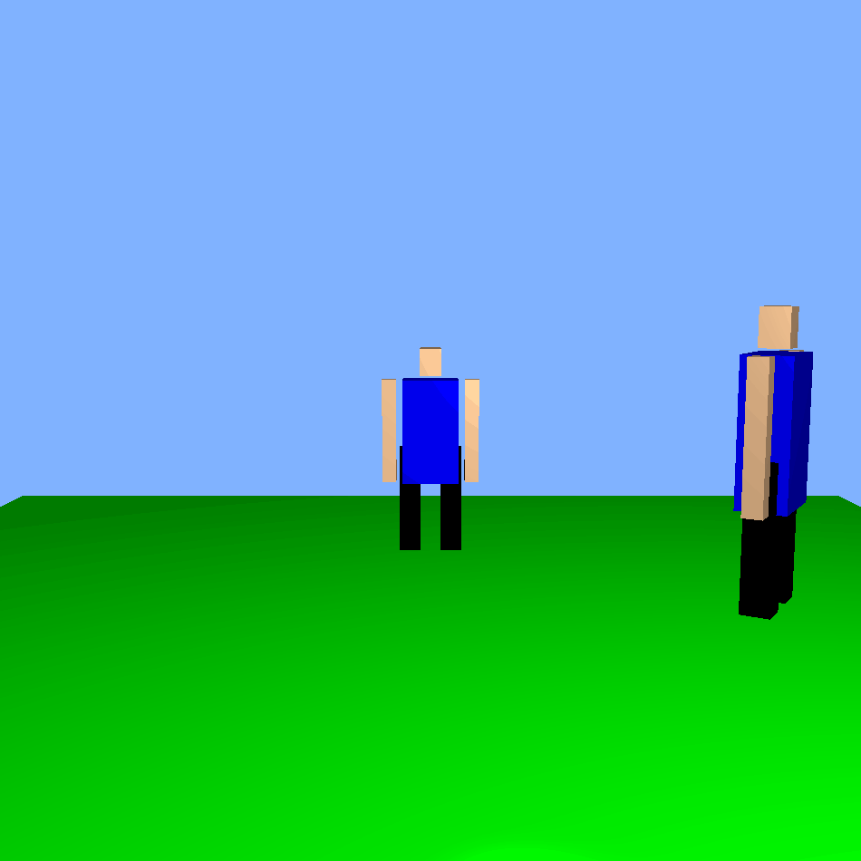

## Surface Shading and Transformations

### 🧱 Description
This program renders a 3D character simulation utilizing surface shading and linear transformation techniques to enhance realism and depth.

### 🛠️ Version
- `g++` 13.2.0  
- `gcc` 11.4.0

### ✅ Requirements
- [GLAD](https://glad.dav1d.de/)
- [GLFW](https://www.glfw.org/) **3.3 or above**
- [GLM](https://github.com/g-truc/glm)
- `gif` (for GIF generation or related functionality)

### 🎮 Controls
- Move the character with: `W`, `A`, `S`, `D`
- Rotate the character with: **Left** and **Right** arrow keys

### 🔍 Note
Ensure terminal output is monitored for additional instructions or debug information during runtime.
